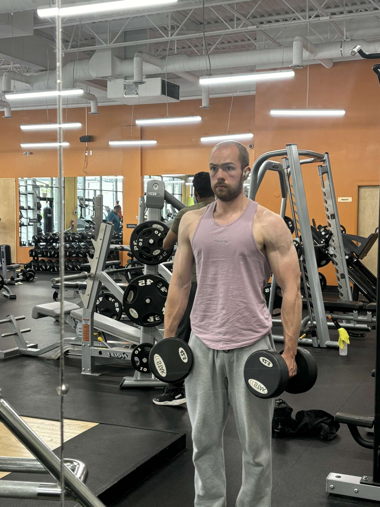
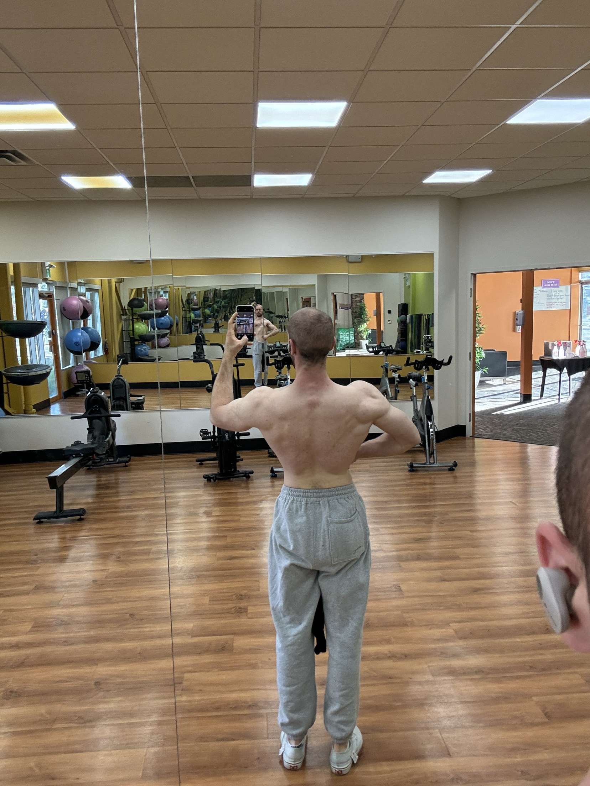

<!DOCTYPE html>
<html lang="en">

<head>
  <meta charset="UTF-8" />
  <meta name="viewport" content="width=device-width, initial-scale=1.0" />
  <title>Coaching by Caden Boyles</title>
  <link rel="icon" href="SRC/Icon.png"></link>

  <!-- AOS -->
  <link rel="stylesheet" href="https://unpkg.com/aos@next/dist/aos.css" />

  <!-- Google font -->
  <link rel="preconnect" href="https://fonts.googleapis.com">
  <link rel="preconnect" href="https://fonts.gstatic.com" crossorigin>
  <link
    href="https://fonts.googleapis.com/css2?family=Ubuntu:ital,wght@0,300;0,400;0,500;0,700;1,300;1,400;1,500;1,700&display=swap"
    rel="stylesheet">

  <!-- font Awesome -->
  <link rel="stylesheet" href="https://cdnjs.cloudflare.com/ajax/libs/font-awesome/4.7.0/css/font-awesome.min.css">

  <!-- TYPE JS -->
  

  <!-- All css -->
  <link rel="stylesheet" href="navbar.css" />
  <link rel="stylesheet" href="home.css" />
  <link rel="stylesheet" href="about.css" />
  <link rel="stylesheet" href="contact.css" />
  <link rel="stylesheet" href="style.css" />

</head>

<body>
  <header class="header">
    <a href="#" id="logo">
      
Coaching by Caden

    </a>
    <nav class="navbar">
      

      <a href="#">HOME</a>
      <a href="#about">ABOUT ME</a>
      <a href="#contact">CONTACT</a>
    </nav>
    

      <i class="fa fa-light fa-bars"></i>
      <nav class="navbar ">
        <svg class="xmark" xmlns="http://www.w3.org/2000/svg" height="20" width="20"
          viewBox="0 0 512 512"><!--!Font Awesome Free 6.5.2 by @fontawesome - https://fontawesome.com License - https://fontawesome.com/license/free Copyright 2024 Fonticons, Inc.-->
          <path fill="#ffffff"
            d="M256 512A256 256 0 1 0 256 0a256 256 0 1 0 0 512zM175 175c9.4-9.4 24.6-9.4 33.9 0l47 47 47-47c9.4-9.4 24.6-9.4 33.9 0s9.4 24.6 0 33.9l-47 47 47 47c9.4 9.4 9.4 24.6 0 33.9s-24.6 9.4-33.9 0l-47-47-47 47c-9.4 9.4-24.6 9.4-33.9 0s-9.4-24.6 0-33.9l47-47-47-47c-9.4-9.4-9.4-24.6 0-33.9z" />
        </svg>

        <a href="#">HOME</a>
        <a href="#about">ABOUT ME</a>
	<a href="#contact">CONTACT</a>
      </nav>
    

  </header>

  <!-- home section start-->
  <section class="home" id="home">
    

    

      

        

          
Hello, my name is

          
Caden Boyles

          
I'm a 

        

      

      

        
      

    

  </section>

  <!-- about section -->
  <section class="about" id="about">
    

      <h2 class="title" data-aos="fade-down">About Me</h2>
      

        

	  
        

        

          

            I'm Caden and I'm a  
          

          

            Hi, I’m Caden, a certified personal trainer and passionate fitness enthusiast. With years of experience, I’ve honed my skills in both bodybuilding and running. My philosophy is simple: fitness should be a lifestyle, not a chore. I believe in creative programming that makes physical and mental health accessible to everyone. Whether it’s weight loss, muscle building, or overall improved fitness, I’m here to guide you on your journey. Let’s break through plateaus and achieve your goals together! 🏋️‍♂️🏃‍♀️💪
          

        

      

    

  </section>
    

  <section class="contact" id="contact">
    

      <h2 class="title" data-aos="fade-down">Contact</h2>
      

        

          

            For any inquiries regarding coaching I can be contacted using through my
          
<a href="https://www.instagram.com/caden.04/">Instagram</a>
        

      

    

  </section>

</section>

  
  
  
  
  
  
</body>

</html>
